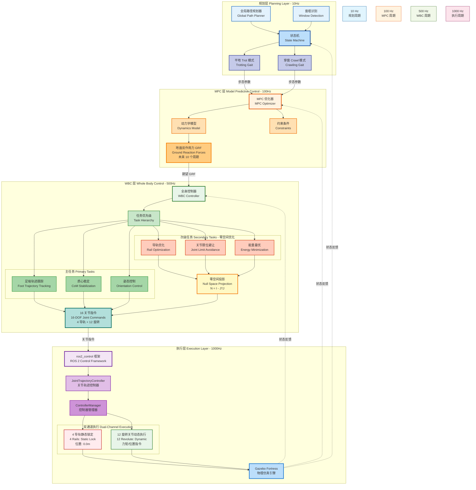

# MPC + WBC 分层控制架构与零空间冗余解析

## 四层控制架构图 (Hierarchical Control Architecture)



## 控制层级详细说明

### 第 1 层：规划层 (10Hz)
- **功能**：全局路径规划，环境感知，状态机切换
- **输入**：传感器数据（激光雷达、相机）
- **输出**：运动模式指令（Trot / Crawl）
- **关键技术**：
  - 窗框识别算法
  - 状态机设计（平地 ↔ 穿窗）
  - 路径规划算法

### 第 2 层：MPC 层 (100Hz)
- **功能**：预测未来轨迹，优化地面反作用力
- **输入**：期望速度、当前状态、步态模式
- **输出**：未来 10 个周期的 GRF
- **关键技术**：
  - 单刚体动力学模型
  - 二次规划（QP）求解器
  - 滚动时域优化

### 第 3 层：WBC 层 (500Hz) - 核心创新
- **功能**：全身控制，任务分配，冗余解析
- **输入**：期望 GRF、足端轨迹、当前状态
- **输出**：16 个关节的力矩/位置指令
- **关键技术**：
  - **任务优先级分层**
  - **零空间投影**（利用 4 个导轨的冗余自由度）
  - 动力学一致性控制

### 第 4 层：执行层 (1000Hz)
- **功能**：底层指令执行，硬件接口
- **输入**：关节指令
- **输出**：电机控制信号
- **关键技术**：
  - ros2_control 标准接口
  - 双通道物理隔离
  - 实时性保证

## 频率设计原理

| 层级 | 频率 | 原因 |
|------|------|------|
| 规划层 | 10Hz | 环境变化慢，降低计算负担 |
| MPC 层 | 100Hz | 平衡预测精度与实时性 |
| WBC 层 | 500Hz | 保证力控制的稳定性 |
| 执行层 | 1000Hz | 匹配电机控制器频率 |

## 数据流向与反馈

```
正向控制流：
规划层 → MPC 层 → WBC 层 → 执行层 → 物理仿真

反馈控制流：
物理仿真 → 状态估计 → WBC 层（闭环）
物理仿真 → 状态估计 → MPC 层（模型更新）
物理仿真 → 状态估计 → 规划层（任务完成检测）
```

## 创新点总结

1. **硬件创新**：4 个冗余导轨，增加工作空间
2. **算法创新**：零空间投影，优化导轨使用
3. **架构创新**：四层分层控制，职责清晰
4. **工程创新**：双通道物理隔离，提高鲁棒性

---

**适用场景**：PPT 幻灯片 3 - 分层控制架构
**展示重点**：MPC + WBC 理论深度 + 冗余导轨工程实践
