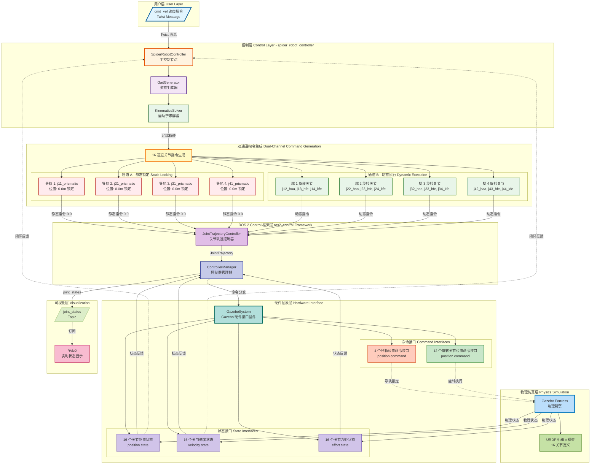

# ROS 2 底层控制系统数据流向图

## 系统架构：高内聚低耦合的控制框架



## 关键技术特点

### 1. 双通道物理隔离机制
- **通道 A（静态锁定）**: 4 个导轨关节固定在 0.0m 位置
- **通道 B（动态执行）**: 12 个旋转关节执行步态运动
- **物理隔离**: 两类关节在硬件接口层完全分离，互不干扰

### 2. 数据流向层次
1. **用户层** → 速度指令输入
2. **控制层** → 步态规划 + 运动学求解
3. **指令生成** → 16 通道双路径生成
4. **框架层** → ros2_control 标准接口
5. **硬件层** → Gazebo 物理引擎接口
6. **仿真层** → 物理状态计算
7. **反馈层** → 状态回传与可视化

### 3. 高内聚低耦合设计
- **模块化**: 每个控制模块职责单一
- **接口标准化**: 使用 ros2_control 标准接口
- **可扩展性**: 易于添加新的控制算法
- **可测试性**: 每个模块可独立测试

### 4. 关节命名规范
```
jXY_type
├── X: 腿编号 (1-4)
├── Y: 关节编号 (1-4)
└── type: prismatic(导轨) / haa(髋外展) / hfe(髋屈伸) / kfe(膝屈伸)
```

## 数据流详细说明

### 正向控制流
```
cmd_vel → 步态生成 → 足端轨迹 → 逆运动学 → 关节角度
→ 双通道分离 → ros2_control → Gazebo → 物理执行
```

### 反馈控制流
```
Gazebo 物理状态 → 硬件接口 → 控制器管理器 
→ joint_states → RViz2 可视化
→ 控制器反馈 → 闭环调整
```

### 双通道指令特征
| 通道 | 关节类型 | 数量 | 控制模式 | 目标值 |
|------|---------|------|---------|--------|
| A | 导轨 (prismatic) | 4 | 静态锁定 | 0.0m |
| B | 旋转 (revolute) | 12 | 动态轨迹 | 步态计算 |

## 系统优势

1. **架构清晰**: 分层设计，职责明确
2. **物理隔离**: 导轨锁定与步态执行互不干扰
3. **标准兼容**: 完全符合 ros2_control 规范
4. **易于调试**: 每层都有明确的输入输出
5. **可维护性**: 模块化设计便于修改和扩展

---

**适用场景**: PPT 幻灯片 2 - 系统架构与工程方法论
**展示重点**: ros2_control 框架深度理解 + 双通道物理隔离创新设计
