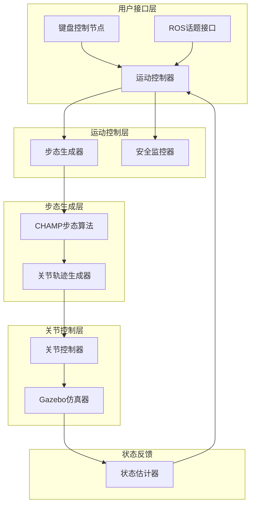

# Design Document

## Overview

本设计文档描述了 dog2 四足机器人在 Gazebo 仿真环境中实现基本前进后退运动控制的系统架构。该系统将基于现有的 CHAMP 四足机器人框架，通过 ROS2 接口实现运动控制，并提供键盘和话题两种控制方式。

系统采用分层架构设计，包括用户接口层、运动控制层、步态生成层和关节控制层，确保各组件职责清晰且易于维护。

## Architecture



### 系统组件说明

1. **用户接口层**：处理用户输入，支持键盘控制和ROS话题控制
2. **运动控制层**：解析运动命令，协调步态生成和安全监控
3. **步态生成层**：基于CHAMP算法生成四足机器人步态
4. **关节控制层**：执行关节轨迹，与Gazebo仿真器交互
5. **状态反馈**：提供机器人状态信息用于闭环控制

## Components and Interfaces

### 1. 键盘控制节点 (KeyboardController)

**职责**：
- 监听键盘输入事件
- 将键盘按键映射为运动命令
- 发布标准化的速度命令

**接口**：
```python
class KeyboardController:
    def __init__(self):
        self.cmd_vel_publisher = self.create_publisher(Twist, '/cmd_vel', 10)
    
    def handle_key_press(self, key: str) -> None:
        """处理键盘按键事件"""
        pass
    
    def publish_velocity_command(self, linear_x: float, angular_z: float) -> None:
        """发布速度命令"""
        pass
```

**键盘映射**：
- 'w' 键：前进 (linear.x = 0.2 m/s)
- 's' 键：后退 (linear.x = -0.2 m/s)
- 空格键：停止 (linear.x = 0.0 m/s)

### 2. 运动控制器 (MovementController)

**职责**：
- 接收和解析运动命令
- 协调步态生成器和安全监控
- 管理机器人运动状态

**接口**：
```python
class MovementController:
    def __init__(self):
        self.cmd_vel_subscriber = self.create_subscription(Twist, '/cmd_vel', self.cmd_vel_callback, 10)
        self.gait_generator = GaitGenerator()
        self.safety_monitor = SafetyMonitor()
    
    def cmd_vel_callback(self, msg: Twist) -> None:
        """处理速度命令"""
        pass
    
    def execute_movement(self, linear_x: float, angular_z: float) -> bool:
        """执行运动命令"""
        pass
    
    def stop_movement(self) -> None:
        """停止运动"""
        pass
```

### 3. 步态生成器 (GaitGenerator)

**职责**：
- 基于CHAMP算法生成四足步态
- 计算各关节的目标位置和速度
- 确保步态的稳定性和连续性

**接口**：
```python
class GaitGenerator:
    def __init__(self):
        self.champ_controller = ChampController()
        self.joint_trajectory_publisher = self.create_publisher(
            JointTrajectory, 
            'joint_group_effort_controller/joint_trajectory', 
            10
        )
    
    def generate_forward_gait(self, velocity: float) -> JointTrajectory:
        """生成前进步态"""
        pass
    
    def generate_backward_gait(self, velocity: float) -> JointTrajectory:
        """生成后退步态"""
        pass
    
    def generate_stop_gait(self) -> JointTrajectory:
        """生成停止步态"""
        pass
```

### 4. 安全监控器 (SafetyMonitor)

**职责**：
- 监控机器人状态和环境
- 检测异常情况并触发安全停止
- 验证运动命令的有效性

**接口**：
```python
class SafetyMonitor:
    def __init__(self):
        self.joint_state_subscriber = self.create_subscription(
            JointState, '/joint_states', self.joint_state_callback, 10
        )
    
    def validate_command(self, cmd: Twist) -> bool:
        """验证运动命令有效性"""
        pass
    
    def check_robot_stability(self) -> bool:
        """检查机器人稳定性"""
        pass
    
    def emergency_stop(self) -> None:
        """紧急停止"""
        pass
```

## Data Models

### 运动命令数据结构

```python
@dataclass
class MovementCommand:
    linear_velocity: float  # 线速度 (m/s)
    angular_velocity: float  # 角速度 (rad/s)
    timestamp: float  # 时间戳
    command_id: str  # 命令ID
    
    def validate(self) -> bool:
        """验证命令参数范围"""
        return (
            -0.5 <= self.linear_velocity <= 0.5 and
            -1.0 <= self.angular_velocity <= 1.0
        )
```

### 机器人状态数据结构

```python
@dataclass
class RobotState:
    joint_positions: Dict[str, float]  # 关节位置
    joint_velocities: Dict[str, float]  # 关节速度
    base_pose: Pose  # 基座位姿
    is_stable: bool  # 稳定性标志
    timestamp: float  # 时间戳
```

### 关节映射配置

基于现有的 `joints.yaml` 配置：

```python
JOINT_MAPPING = {
    'left_front': ['j3', 'j31', 'j311', 'j3111'],
    'right_front': ['j2', 'j21', 'j211', 'j2111'],
    'left_hind': ['j4', 'j41', 'j411', 'j4111'],
    'right_hind': ['j1', 'j11', 'j111', 'j1111']
}
```

## Correctness Properties

*A property is a characteristic or behavior that should hold true across all valid executions of a system-essentially, a formal statement about what the system should do. Properties serve as the bridge between human-readable specifications and machine-verifiable correctness guarantees.*
### Property Reflection

在分析所有验收标准后，我发现了一些可以合并的冗余属性：

- 属性1.1和2.1可以合并为一个通用的"命令响应"属性
- 属性1.2和2.2可以合并为一个通用的"运动稳定性"属性  
- 属性1.3和2.3可以合并为一个通用的"关节协调"属性
- 属性1.4和2.4可以合并为一个通用的"位置反馈"属性
- 属性5.1、5.2、5.3是具体的键盘映射示例，保持独立
- 其他属性提供独特的验证价值，保持独立

### 基于需求的正确性属性

Property 1: 运动命令响应一致性
*For any* 有效的运动命令（前进、后退、停止），运动控制器应该生成相应的步态模式并正确执行
**Validates: Requirements 1.1, 2.1, 3.1**

Property 2: 运动过程稳定性保持
*For any* 运动状态（前进或后退），机器人应该始终保持稳定的四足步态，重心在支撑多边形内
**Validates: Requirements 1.2, 2.2**

Property 3: 关节协调完整性
*For any* 运动命令执行时，关节控制器应该协调所有12个关节的运动，确保没有关节被遗漏
**Validates: Requirements 1.3, 2.3**

Property 4: 位置反馈准确性
*For any* 机器人运动，Gazebo仿真器中显示的机器人位置变化应该与运动命令方向一致
**Validates: Requirements 1.4, 2.4**

Property 5: 停止过渡平滑性
*For any* 运动状态，当接收到停止命令时，机器人应该平滑过渡到稳定的站立姿态
**Validates: Requirements 3.2, 3.3**

Property 6: 无效命令拒绝
*For any* 无效的运动命令（超出速度范围、格式错误等），运动控制器应该拒绝执行并保持当前状态
**Validates: Requirements 4.1**

Property 7: 异常状态错误报告
*For any* 系统异常状态，运动控制器应该返回描述性的错误信息
**Validates: Requirements 4.2**

Property 8: 安全停止机制
*For any* 关节控制失败情况，运动控制器应该立即执行安全停止程序
**Validates: Requirements 4.3**

Property 9: ROS消息处理兼容性
*For any* 符合geometry_msgs/Twist格式的ROS消息，运动控制器应该正确解析并执行相应运动
**Validates: Requirements 5.4, 5.5**

Property 10: CHAMP框架集成
*For any* 步态生成请求，步态生成器应该使用CHAMP算法并与CHAMP框架正确集成
**Validates: Requirements 6.1, 6.2**

Property 11: Gazebo通信接口
*For any* 关节控制命令，关节控制器应该通过ROS接口与Gazebo中的机器人模型正确通信
**Validates: Requirements 6.4**

## Error Handling

### 输入验证错误处理

**速度范围验证**：
- 线速度限制：-0.5 到 0.5 m/s
- 角速度限制：-1.0 到 1.0 rad/s
- 超出范围的命令将被拒绝并记录警告

**消息格式验证**：
- 验证geometry_msgs/Twist消息的完整性
- 检查必需字段的存在性
- 处理损坏或不完整的消息

### 系统状态错误处理

**关节控制失败**：
```python
def handle_joint_control_failure(self, joint_name: str, error: Exception):
    """处理关节控制失败"""
    self.logger.error(f"Joint {joint_name} control failed: {error}")
    self.emergency_stop()
    self.publish_error_status(f"Joint control failure: {joint_name}")
```

**通信超时处理**：
```python
def handle_communication_timeout(self, timeout_duration: float):
    """处理通信超时"""
    if timeout_duration > self.MAX_TIMEOUT:
        self.logger.warning("Communication timeout detected")
        self.enter_safe_mode()
```

**稳定性监控**：
```python
def monitor_stability(self, robot_state: RobotState):
    """监控机器人稳定性"""
    if not robot_state.is_stable:
        self.logger.warning("Robot stability compromised")
        self.reduce_movement_speed()
        if self.instability_duration > self.MAX_INSTABILITY_TIME:
            self.emergency_stop()
```

### 恢复机制

**自动恢复策略**：
1. 轻微错误：降低运动速度，继续执行
2. 中等错误：暂停运动，等待用户确认
3. 严重错误：紧急停止，需要手动重启

**错误状态报告**：
- 通过ROS话题发布错误状态
- 记录详细的错误日志
- 提供错误恢复建议

## Testing Strategy

### 双重测试方法

本系统采用单元测试和基于属性的测试相结合的方法：

**单元测试**：
- 验证具体的键盘映射示例（'w'键→前进，'s'键→后退，空格键→停止）
- 测试边界条件和错误情况
- 验证系统初始化和配置加载

**基于属性的测试**：
- 验证通用属性在所有输入下都成立
- 使用随机生成的运动命令进行大量测试
- 每个属性测试运行最少100次迭代

### 属性测试配置

**测试框架**：使用 Python 的 `hypothesis` 库进行基于属性的测试

**测试配置**：
```python
from hypothesis import given, strategies as st
import pytest

# 测试数据生成策略
@st.composite
def valid_twist_command(draw):
    """生成有效的Twist命令"""
    linear_x = draw(st.floats(min_value=-0.5, max_value=0.5))
    angular_z = draw(st.floats(min_value=-1.0, max_value=1.0))
    return Twist(linear=Vector3(x=linear_x), angular=Vector3(z=angular_z))

@st.composite  
def invalid_twist_command(draw):
    """生成无效的Twist命令"""
    linear_x = draw(st.one_of(
        st.floats(min_value=-10.0, max_value=-0.6),
        st.floats(min_value=0.6, max_value=10.0)
    ))
    return Twist(linear=Vector3(x=linear_x))
```

**测试标签格式**：
每个属性测试必须包含以下标签注释：
```python
# Feature: dog2-basic-movement, Property 1: 运动命令响应一致性
@given(valid_twist_command())
def test_movement_command_response_consistency(self, cmd):
    """测试运动命令响应一致性"""
    pass
```

### 集成测试策略

**Gazebo集成测试**：
- 启动完整的Gazebo仿真环境
- 验证机器人模型加载和关节控制
- 测试视觉反馈和物理仿真

**ROS节点集成测试**：
- 测试节点间的消息传递
- 验证话题订阅和发布
- 检查服务调用和响应

**CHAMP框架集成测试**：
- 验证与CHAMP算法的正确集成
- 测试步态生成的准确性
- 检查配置参数的正确加载

### 性能测试

**响应时间测试**：
- 命令响应时间 < 100ms
- 紧急停止响应时间 < 50ms
- 步态生成计算时间 < 20ms

**稳定性测试**：
- 长时间运行测试（30分钟连续运动）
- 内存泄漏检测
- CPU使用率监控

**鲁棒性测试**：
- 网络延迟和丢包测试
- 高频命令输入测试
- 异常输入压力测试