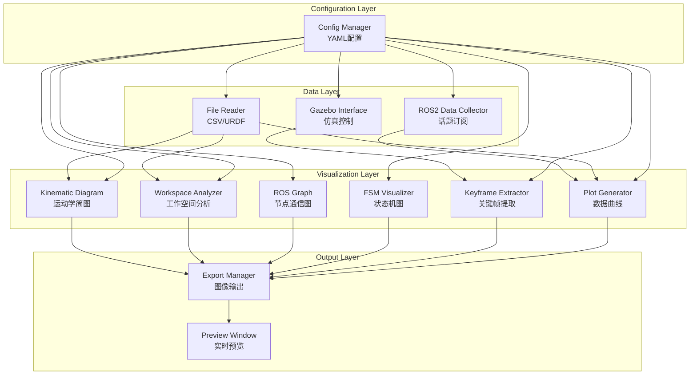

# Design Document

## Overview

演示数据采集与可视化系统是一个用于自动生成机器人项目演示材料的工具集。该系统通过 ROS2 接口采集仿真数据，并使用 Python 可视化库生成专业的工程图表，包括运动学简图、工作空间分析、系统架构图、状态机流转图、关键帧序列和数据曲线图。

系统设计遵循模块化原则，每个可视化功能独立实现，可单独调用或批量执行。所有模块共享统一的配置系统和输出格式，确保生成的图表风格一致、专业。

## Architecture

### System Components




### Technology Stack

- **Language**: Python 3.10+
- **ROS**: ROS2 Humble
- **Visualization**: Matplotlib 3.7+, Graphviz, Pillow
- **Data Processing**: NumPy, Pandas
- **URDF Parsing**: urdfpy or xml.etree
- **Configuration**: PyYAML
- **Screenshot**: python-xlib (Linux), pyautogui (cross-platform)

## Components and Interfaces

### 1. Configuration Manager

**Purpose**: 统一管理所有可视化模块的配置参数

**Configuration Schema** (config.yaml):
```yaml
# 全局样式配置
style:
  color_scheme: "dark_tech"  # dark_tech, light_professional
  background_color: "#2b2b2b"
  primary_color: "#00bcd4"
  secondary_color: "#ff9800"
  font_family: "Arial"
  font_size_title: 16
  font_size_label: 12
  dpi: 300

# 数据源配置
data_sources:
  urdf_path: "src/dog2_description/urdf/dog2.urdf.xacro"
  joint_states_topic: "/joint_states"
  imu_topic: "/imu/data"
  odom_topic: "/odom"
  
# 输出配置
output:
  directory: "presentation_outputs"
  format: "png"
  preview_enabled: true

# 各模块特定配置
kinematic_diagram:
  view: "side"  # side, top, front
  show_coordinate_frames: true
  joint_labels: true
  
workspace_analysis:
  leg_id: "FL"  # FL, FR, RL, RR
  rail_extension: 0.1  # meters
  resolution: 100
  
ros_graph:
  nodes:
    - name: "Joystick"
      type: "input"
    - name: "MPC Controller"
      type: "core"
    - name: "Gazebo"
      type: "sim"
  connections:
    - from: "Joystick"
      to: "MPC Controller"
      label: "Target Velocity"
    - from: "MPC Controller"
      to: "Gazebo"
      label: "Joint Commands"
    - from: "Gazebo"
      to: "MPC Controller"
      label: "Joint States / IMU"
      
fsm_visualization:
  states:
    - name: "Approach"
      description: "接近障碍"
    - name: "Rail_Extend"
      description: "导轨伸出"
    - name: "Leg_Fold"
      description: "折叠过窗"
    - name: "Recover"
      description: "恢复姿态"
  transitions:
    - from: "Approach"
      to: "Rail_Extend"
    - from: "Rail_Extend"
      to: "Leg_Fold"
    - from: "Leg_Fold"
      to: "Recover"
    - from: "Recover"
      to: "Approach"
      
keyframe_extraction:
  timestamps: [0.0, 2.5, 5.0, 7.5]  # seconds
  window_title: "Gazebo"
  
plot_generation:
  variables:
    - name: "body_height"
      topic: "/odom"
      field: "pose.pose.position.z"
      ylabel: "Height (m)"
    - name: "joint_angle_FL_hip"
      topic: "/joint_states"
      field: "position[0]"
      ylabel: "Angle (rad)"
```

**Interface**:
```python
class ConfigManager:
    def __init__(self, config_path: str = "config.yaml"):
        """加载配置文件"""
        
    def get_style(self) -> Dict[str, Any]:
        """获取全局样式配置"""
        
    def get_module_config(self, module_name: str) -> Dict[str, Any]:
        """获取特定模块的配置"""
        
    def get_output_config(self) -> Dict[str, Any]:
        """获取输出配置"""
```


### 2. ROS2 Data Collector

**Purpose**: 从 ROS2 话题采集实时数据并保存为 CSV 格式

**Interface**:
```python
class ROS2DataCollector:
    def __init__(self, config: ConfigManager):
        """初始化 ROS2 节点和订阅器"""
        
    def subscribe_topic(self, topic_name: str, msg_type: Type):
        """订阅指定话题"""
        
    def start_recording(self, duration: float = None):
        """开始记录数据"""
        
    def stop_recording(self):
        """停止记录并保存数据"""
        
    def save_to_csv(self, output_path: str):
        """将采集的数据保存为 CSV 文件"""
        
    def get_data_frame(self) -> pd.DataFrame:
        """返回 Pandas DataFrame 格式的数据"""
```

**Data Format** (CSV):
```csv
timestamp,joint_FL_rail,joint_FL_hip,joint_FL_thigh,joint_FL_knee,body_x,body_y,body_z,imu_ax,imu_ay,imu_az
0.000,0.0,0.0,0.5,-1.0,0.0,0.0,0.3,0.0,0.0,9.81
0.010,0.0,0.0,0.51,-1.01,0.001,0.0,0.3,0.1,0.0,9.82
...
```

### 3. Kinematic Diagram Generator

**Purpose**: 生成机器人的运动学简图，展示骨架结构和关节配置

**Algorithm**:
1. 解析 URDF/Xacro 文件，提取关节和连杆信息
2. 计算各连杆在指定视角下的 2D 投影坐标
3. 使用 Matplotlib 绘制骨架线条和关节圆圈
4. 标注坐标系、关节角度和导轨位置

**Interface**:
```python
class KinematicDiagramGenerator:
    def __init__(self, config: ConfigManager):
        """初始化配置和 URDF 解析器"""
        
    def parse_urdf(self, urdf_path: str) -> Dict:
        """解析 URDF 文件，提取关节树结构"""
        
    def compute_forward_kinematics(self, joint_angles: Dict[str, float]) -> Dict[str, np.ndarray]:
        """计算正运动学，获取各连杆位置"""
        
    def project_to_2d(self, positions_3d: Dict, view: str) -> Dict[str, Tuple[float, float]]:
        """将 3D 坐标投影到 2D 平面"""
        
    def draw_skeleton(self, ax: plt.Axes, positions_2d: Dict):
        """绘制骨架线条"""
        
    def draw_joints(self, ax: plt.Axes, positions_2d: Dict):
        """绘制关节圆圈"""
        
    def annotate_coordinates(self, ax: plt.Axes, position: Tuple[float, float]):
        """标注坐标系"""
        
    def annotate_joints(self, ax: plt.Axes, positions_2d: Dict, joint_angles: Dict):
        """标注关节角度和导轨位置"""
        
    def generate(self, output_path: str, joint_angles: Dict[str, float] = None):
        """生成完整的运动学简图"""
```

**Output Example**:
- 侧视图展示一条腿的 4-DOF 结构
- 髋关节处标注 XYZ 坐标系
- 导轨标注 d₁ 伸缩方向
- 旋转关节标注 θ₁, θ₂, θ₃


### 4. Workspace Analyzer

**Purpose**: 分析并可视化腿部工作空间，对比导轨扩展前后的差异

**Algorithm**:
1. 定义腿部参数（连杆长度、关节限位）
2. 使用网格搜索或采样方法计算可达工作空间
3. 计算普通腿（导轨位置=0）的工作空间边界
4. 计算扩展腿（导轨伸出）的工作空间边界
5. 绘制重叠的扇形区域对比图

**Interface**:
```python
class WorkspaceAnalyzer:
    def __init__(self, config: ConfigManager):
        """初始化配置和腿部参数"""
        
    def set_leg_parameters(self, l1: float, l2: float, l3: float):
        """设置连杆长度"""
        
    def compute_reachable_workspace(self, rail_position: float, resolution: int = 100) -> np.ndarray:
        """计算可达工作空间点云"""
        
    def compute_workspace_boundary(self, points: np.ndarray) -> np.ndarray:
        """计算工作空间边界（凸包）"""
        
    def plot_workspace_comparison(self, ax: plt.Axes, 
                                   normal_boundary: np.ndarray,
                                   extended_boundary: np.ndarray):
        """绘制工作空间对比图"""
        
    def generate(self, output_path: str, rail_extension: float):
        """生成完整的工作空间对比图"""
```

**Workspace Calculation**:
```python
# 对于给定的导轨位置，遍历所有可能的关节角度组合
for theta1 in range(theta1_min, theta1_max, step):
    for theta2 in range(theta2_min, theta2_max, step):
        for theta3 in range(theta3_min, theta3_max, step):
            # 正运动学计算足端位置
            foot_pos = forward_kinematics(rail_pos, theta1, theta2, theta3)
            workspace_points.append(foot_pos)
```

### 5. ROS Graph Generator

**Purpose**: 生成简洁的 ROS 节点通信图，展示闭环控制架构

**Interface**:
```python
class ROSGraphGenerator:
    def __init__(self, config: ConfigManager):
        """初始化配置"""
        
    def add_node(self, name: str, node_type: str, position: Tuple[float, float] = None):
        """添加节点"""
        
    def add_connection(self, from_node: str, to_node: str, label: str, bidirectional: bool = False):
        """添加连接"""
        
    def draw_node(self, ax: plt.Axes, name: str, position: Tuple[float, float], node_type: str):
        """绘制节点框"""
        
    def draw_connection(self, ax: plt.Axes, from_pos: Tuple, to_pos: Tuple, label: str):
        """绘制连接箭头"""
        
    def generate(self, output_path: str):
        """生成完整的 ROS 通信图"""
```

**Layout Strategy**:
- 输入节点（Joystick/FSM）放置在左侧
- 核心控制器（MPC Controller）放置在中间
- 仿真环境（Gazebo）放置在右侧
- 前向数据流使用实线箭头
- 反馈数据流使用虚线箭头


### 6. FSM Visualizer

**Purpose**: 生成状态机流转图，展示机器人的控制策略

**Interface**:
```python
class FSMVisualizer:
    def __init__(self, config: ConfigManager):
        """初始化配置"""
        
    def add_state(self, name: str, description: str, icon_path: str = None):
        """添加状态节点"""
        
    def add_transition(self, from_state: str, to_state: str, condition: str = None):
        """添加状态转换"""
        
    def compute_circular_layout(self, num_states: int) -> Dict[str, Tuple[float, float]]:
        """计算圆形布局的状态位置"""
        
    def draw_state(self, ax: plt.Axes, name: str, position: Tuple[float, float], description: str):
        """绘制状态圆圈"""
        
    def draw_transition(self, ax: plt.Axes, from_pos: Tuple, to_pos: Tuple, condition: str):
        """绘制状态转换箭头"""
        
    def add_robot_icon(self, ax: plt.Axes, position: Tuple[float, float], icon_path: str):
        """在状态旁边添加机器人姿态图标"""
        
    def generate(self, output_path: str):
        """生成完整的状态机流转图"""
```

**State Machine for Window Crossing**:
```
States:
1. Approach - 机器人正常行走接近窗框
2. Rail_Extend - 导轨伸出，扩展前腿工作空间
3. Leg_Fold - 前腿跨过，后腿折叠通过窗框
4. Recover - 恢复正常站立姿态

Transitions:
Approach → Rail_Extend (检测到窗框)
Rail_Extend → Leg_Fold (导轨到位)
Leg_Fold → Recover (身体通过窗框)
Recover → Approach (姿态恢复完成)
```

### 7. Keyframe Extractor

**Purpose**: 从 Gazebo 仿真中自动提取关键帧图像

**Interface**:
```python
class KeyframeExtractor:
    def __init__(self, config: ConfigManager):
        """初始化配置和截图工具"""
        
    def find_window(self, window_title: str) -> Tuple[int, int, int, int]:
        """查找 Gazebo 窗口位置"""
        
    def capture_screenshot(self, window_bounds: Tuple) -> np.ndarray:
        """截取指定窗口的屏幕画面"""
        
    def schedule_captures(self, timestamps: List[float], callback: Callable):
        """在指定时间点调度截图"""
        
    def add_timestamp_annotation(self, image: np.ndarray, timestamp: float) -> np.ndarray:
        """在图像上添加时间戳标注"""
        
    def create_keyframe_strip(self, images: List[np.ndarray], output_path: str):
        """将多张关键帧横向拼接成一张图"""
        
    def generate(self, output_path: str, timestamps: List[float]):
        """生成完整的关键帧序列"""
```

**Capture Strategy**:
1. 启动 Gazebo 仿真
2. 使用 ROS2 时钟同步
3. 在指定时间点触发截图
4. 后处理添加时间戳
5. 拼接成横向序列


### 8. Plot Generator

**Purpose**: 生成专业的数据曲线图，展示机器人运动的稳定性

**Interface**:
```python
class PlotGenerator:
    def __init__(self, config: ConfigManager):
        """初始化配置和样式"""
        
    def load_data(self, csv_path: str) -> pd.DataFrame:
        """加载 CSV 数据文件"""
        
    def plot_time_series(self, ax: plt.Axes, 
                         time: np.ndarray, 
                         data: np.ndarray,
                         ylabel: str,
                         title: str):
        """绘制时序曲线"""
        
    def plot_multiple_variables(self, data: pd.DataFrame, 
                                variables: List[str],
                                output_path: str):
        """绘制多变量对比图"""
        
    def apply_style(self, fig: plt.Figure, ax: plt.Axes):
        """应用统一的样式配置"""
        
    def generate(self, csv_path: str, variables: List[str], output_path: str):
        """生成完整的数据曲线图"""
```

**Plot Style Configuration**:
```python
style = {
    'figure.facecolor': '#2b2b2b',  # 深灰背景
    'axes.facecolor': '#1e1e1e',
    'axes.edgecolor': '#00bcd4',    # 亮蓝边框
    'axes.labelcolor': '#ffffff',
    'axes.grid': True,
    'grid.color': '#404040',
    'grid.linestyle': '--',
    'grid.alpha': 0.5,
    'xtick.color': '#ffffff',
    'ytick.color': '#ffffff',
    'lines.linewidth': 2,
    'lines.color': '#00bcd4',       # 亮蓝曲线
}
```

**Common Plot Types**:
1. Body Height (Z position) - 展示机器人高度稳定性
2. Joint Angles - 展示关节运动规律
3. IMU Acceleration - 展示加速度波动
4. Rail Position - 展示导轨伸缩过程

### 9. Export Manager

**Purpose**: 统一管理图像输出和文件组织

**Interface**:
```python
class ExportManager:
    def __init__(self, config: ConfigManager):
        """初始化输出目录和配置"""
        
    def create_output_directory(self) -> str:
        """创建输出目录结构"""
        
    def save_figure(self, fig: plt.Figure, filename: str, dpi: int = 300):
        """保存 Matplotlib 图像"""
        
    def save_image(self, image: np.ndarray, filename: str):
        """保存 NumPy 图像数组"""
        
    def generate_index(self, output_files: List[str]):
        """生成索引文件，列出所有输出"""
        
    def cleanup_temp_files(self):
        """清理临时文件"""
```

**Output Directory Structure**:
```
presentation_outputs/
├── kinematic_diagrams/
│   ├── side_view.png
│   └── top_view.png
├── workspace_analysis/
│   └── workspace_comparison.png
├── ros_graphs/
│   └── control_architecture.png
├── fsm_diagrams/
│   └── window_crossing_fsm.png
├── keyframes/
│   ├── frame_0.0s.png
│   ├── frame_2.5s.png
│   ├── frame_5.0s.png
│   ├── frame_7.5s.png
│   └── keyframe_strip.png
├── plots/
│   ├── body_height.png
│   ├── joint_angles.png
│   └── imu_data.png
└── index.md
```


### 10. Preview Window

**Purpose**: 提供实时预览功能，允许用户在生成过程中查看和调整

**Interface**:
```python
class PreviewWindow:
    def __init__(self, config: ConfigManager):
        """初始化预览窗口"""
        
    def show_image(self, image: np.ndarray, title: str):
        """显示图像预览"""
        
    def wait_for_confirmation(self) -> bool:
        """等待用户确认或调整"""
        
    def get_user_feedback(self) -> Dict[str, Any]:
        """获取用户反馈和调整参数"""
        
    def close(self):
        """关闭预览窗口"""
```

## Data Models

### URDFModel
```python
@dataclass
class Joint:
    name: str
    type: str  # revolute, prismatic, fixed
    parent: str
    child: str
    origin: np.ndarray  # [x, y, z, roll, pitch, yaw]
    axis: np.ndarray    # [x, y, z]
    limits: Tuple[float, float]  # (lower, upper)

@dataclass
class Link:
    name: str
    visual_mesh: str
    collision_mesh: str
    inertial: Dict[str, Any]

@dataclass
class URDFModel:
    joints: Dict[str, Joint]
    links: Dict[str, Link]
    joint_tree: Dict[str, List[str]]  # parent -> children
```

### TimeSeriesData
```python
@dataclass
class TimeSeriesData:
    timestamps: np.ndarray
    variables: Dict[str, np.ndarray]
    metadata: Dict[str, Any]
    
    def get_variable(self, name: str) -> np.ndarray:
        """获取指定变量的数据"""
        
    def get_time_range(self, start: float, end: float) -> 'TimeSeriesData':
        """获取指定时间范围的数据"""
        
    def resample(self, frequency: float) -> 'TimeSeriesData':
        """重采样数据"""
```

### WorkspaceData
```python
@dataclass
class WorkspaceData:
    points: np.ndarray  # Nx3 array of reachable points
    boundary: np.ndarray  # Mx3 array of boundary points
    volume: float
    rail_position: float
    
    def project_to_plane(self, plane: str) -> np.ndarray:
        """投影到指定平面"""
```


## Correctness Properties

*A property is a characteristic or behavior that should hold true across all valid executions of a system—essentially, a formal statement about what the system should do. Properties serve as the bridge between human-readable specifications and machine-verifiable correctness guarantees.*

### Property 1: Topic Subscription Completeness
*For any* ROS2 topic specified in the configuration, when the Data_Collector starts recording, it should successfully subscribe to that topic and record at least one message before stopping.

**Validates: Requirements 1.1, 1.2, 1.3**

### Property 2: Timestamp Monotonicity
*For any* recorded data sequence, the timestamps should be strictly monotonically increasing (each timestamp is greater than the previous one).

**Validates: Requirements 1.4**

### Property 3: Data Persistence Round-Trip
*For any* data collected during a recording session, saving to CSV and then loading the CSV file should produce equivalent data (same number of rows, same column names, same values within floating-point precision).

**Validates: Requirements 1.5**

### Property 4: URDF Parsing Completeness
*For any* valid URDF file, the Kinematic_Diagram_Generator should successfully parse all joints and links without errors, and the number of parsed joints should equal the number of joint elements in the URDF.

**Validates: Requirements 2.1**

### Property 5: Image Generation Success
*For any* successfully parsed robot model, all visualization modules (Kinematic_Diagram_Generator, Workspace_Analyzer, ROS_Graph_Generator, FSM_Visualizer) should generate output image files that exist and are non-empty.

**Validates: Requirements 2.2, 3.3, 4.1, 5.1**

### Property 6: Output Format Consistency
*For any* generated visualization image, the file should be in PNG format, have the configured DPI resolution, and be readable by standard image libraries.

**Validates: Requirements 2.6, 3.6, 4.5, 5.5, 6.3, 7.6**

### Property 7: Workspace Extension Property
*For any* leg configuration, the workspace volume with rail extension should be strictly greater than the workspace volume without extension (extended_volume > normal_volume).

**Validates: Requirements 3.1, 3.2**

### Property 8: Graph Connectivity Preservation
*For any* ROS graph specification with N nodes and M connections, the generated graph image should contain exactly N node representations and M connection arrows.

**Validates: Requirements 4.1, 4.2**

### Property 9: FSM State Completeness
*For any* state machine definition with N states, the generated FSM diagram should contain exactly N state circles, and each state should have a visible label.

**Validates: Requirements 5.1, 5.3**

### Property 10: FSM Transition Completeness
*For any* state machine with M transitions, the generated FSM diagram should contain exactly M transition arrows connecting the appropriate states.

**Validates: Requirements 5.2**

### Property 11: Keyframe Timestamp Correspondence
*For any* list of N requested timestamps, the Keyframe_Extractor should generate exactly N keyframe images, and each image should have a timestamp annotation matching one of the requested timestamps.

**Validates: Requirements 6.2, 6.4**

### Property 12: Keyframe Strip Composition
*For any* set of N keyframe images, the generated keyframe strip should have a width approximately equal to N times the width of a single keyframe (within 10% tolerance for spacing).

**Validates: Requirements 6.5**

### Property 13: CSV Data Integrity
*For any* valid CSV file with time-series data, the Plot_Generator should successfully load all rows and columns without data loss (loaded row count equals file row count).

**Validates: Requirements 7.1**

### Property 14: Plot Variable Correspondence
*For any* list of N variables specified for plotting, the Plot_Generator should generate a figure with exactly N subplots or N curves, each corresponding to one variable.

**Validates: Requirements 7.2**

### Property 15: Plot Axis Labeling
*For any* generated plot, both X-axis and Y-axis should have non-empty labels, and the Y-axis label should match the variable name or description from the configuration.

**Validates: Requirements 7.3, 7.5**

### Property 16: Batch Execution Completeness
*For any* batch generation command with N modules enabled, the system should attempt to execute all N modules, and the number of output files should be at least N (one per module, possibly more).

**Validates: Requirements 8.1, 8.4**

### Property 17: Error Isolation
*For any* batch execution where one module fails, the remaining modules should still execute successfully, and the total number of generated files should be at least (N-1) where N is the number of modules.

**Validates: Requirements 8.3**

### Property 18: Index File Completeness
*For any* completed batch generation that produces N output files, the generated index file should list exactly N files with their paths and descriptions.

**Validates: Requirements 8.5**

### Property 19: Configuration Loading Robustness
*For any* valid YAML configuration file, the ConfigManager should successfully load all sections without raising exceptions, and all required fields should have non-null values.

**Validates: Requirements 9.1**

### Property 20: Configuration Application
*For any* configuration parameter (color, font, data source), when specified in the config file, the generated outputs should reflect that parameter (e.g., if background color is set to "#2b2b2b", the generated plot should have that background color).

**Validates: Requirements 9.2, 9.3, 9.4**

### Property 21: Default Configuration Fallback
*For any* missing or invalid configuration file, the system should successfully initialize with default values and generate at least one output file without crashing.

**Validates: Requirements 9.5**


## Error Handling

### Data Collection Errors

**Topic Subscription Failures**:
- If a specified topic does not exist, log a warning and continue with other topics
- If no topics are available, raise an error and exit gracefully
- Implement timeout mechanism (5 seconds) for topic discovery

**Data Recording Errors**:
- If disk space is insufficient, stop recording and save partial data
- If message deserialization fails, log the error and skip that message
- Implement buffer overflow protection (max 10000 messages in memory)

### Visualization Generation Errors

**URDF Parsing Errors**:
- If URDF file is not found, raise FileNotFoundError with helpful message
- If URDF syntax is invalid, report the specific line and error
- If required joints/links are missing, provide a list of missing elements

**Image Generation Errors**:
- If matplotlib fails to render, save the figure data as pickle for debugging
- If file write fails due to permissions, try alternative output directory
- If memory is insufficient for large images, reduce DPI and retry

**Workspace Calculation Errors**:
- If inverse kinematics has no solution for some configurations, skip those points
- If workspace is empty (no reachable points), raise ValueError with diagnostic info
- Implement progress callback for long-running calculations

### Configuration Errors

**Missing Configuration**:
- Use default values for all missing fields
- Log warnings for each missing field
- Generate a template configuration file if none exists

**Invalid Configuration Values**:
- Validate all numeric values are within reasonable ranges
- Validate all file paths exist before processing
- Validate color codes are valid hex or RGB format
- If validation fails, use default value and log warning

### System-Level Errors

**ROS2 Initialization Failures**:
- If ROS2 is not available, disable data collection features
- Provide clear error message about ROS2 installation
- Allow visualization features to work without ROS2

**Gazebo Interface Errors**:
- If Gazebo window is not found, retry up to 3 times with 1-second delay
- If screenshot fails, log error and continue with other keyframes
- Provide manual screenshot option as fallback

**File System Errors**:
- Create output directories if they don't exist
- Handle permission errors by trying alternative locations
- Implement atomic file writes (write to temp, then rename)

## Testing Strategy

### Dual Testing Approach

This system will use both **unit tests** and **property-based tests** to ensure comprehensive coverage:

- **Unit tests**: Verify specific examples, edge cases, and error conditions
- **Property tests**: Verify universal properties across all inputs
- Both are complementary and necessary for comprehensive coverage

### Unit Testing

Unit tests will focus on:
- Specific examples that demonstrate correct behavior (e.g., parsing a known URDF file)
- Integration points between components (e.g., ConfigManager → DataCollector)
- Edge cases and error conditions (e.g., empty CSV file, invalid YAML)
- UI components that cannot be property-tested (e.g., PreviewWindow)

**Example Unit Tests**:
```python
def test_config_manager_loads_default_config():
    """Test that ConfigManager loads default values when no config file exists"""
    
def test_data_collector_handles_missing_topic():
    """Test that DataCollector logs warning for non-existent topic"""
    
def test_kinematic_diagram_parses_dog2_urdf():
    """Test that KinematicDiagramGenerator correctly parses the Dog2 URDF"""
    
def test_plot_generator_handles_empty_csv():
    """Test that PlotGenerator raises appropriate error for empty CSV"""
```

### Property-Based Testing

Property-based tests will verify universal correctness properties across many randomly generated inputs. We will use **Hypothesis** (Python's property-based testing library) for implementation.

**Configuration**:
- Minimum 100 iterations per property test
- Each property test references its design document property
- Tag format: `# Feature: presentation-visualization-system, Property N: [property text]`

**Test Generators**:

```python
# Generator for valid URDF models
@st.composite
def urdf_model(draw):
    num_joints = draw(st.integers(min_value=1, max_value=20))
    joints = {}
    for i in range(num_joints):
        joints[f"joint_{i}"] = Joint(
            name=f"joint_{i}",
            type=draw(st.sampled_from(["revolute", "prismatic"])),
            parent=f"link_{i}",
            child=f"link_{i+1}",
            origin=draw(st.arrays(np.float64, 6, elements=st.floats(-10, 10))),
            axis=draw(st.arrays(np.float64, 3, elements=st.floats(-1, 1))),
            limits=draw(st.tuples(st.floats(-3.14, 0), st.floats(0, 3.14)))
        )
    return URDFModel(joints=joints, links={}, joint_tree={})

# Generator for time-series data
@st.composite
def time_series_data(draw):
    num_points = draw(st.integers(min_value=10, max_value=1000))
    timestamps = np.sort(draw(st.arrays(np.float64, num_points, 
                                        elements=st.floats(0, 100))))
    variables = {
        "var1": draw(st.arrays(np.float64, num_points, 
                              elements=st.floats(-10, 10))),
        "var2": draw(st.arrays(np.float64, num_points, 
                              elements=st.floats(-10, 10)))
    }
    return TimeSeriesData(timestamps=timestamps, variables=variables, metadata={})

# Generator for configuration dictionaries
@st.composite
def config_dict(draw):
    return {
        "style": {
            "background_color": draw(st.sampled_from(["#2b2b2b", "#ffffff"])),
            "primary_color": draw(st.sampled_from(["#00bcd4", "#ff9800"])),
            "dpi": draw(st.integers(min_value=72, max_value=600))
        },
        "output": {
            "directory": draw(st.text(min_size=1, max_size=50)),
            "format": "png"
        }
    }
```

**Example Property Tests**:

```python
@given(time_series_data())
def test_property_2_timestamp_monotonicity(data):
    """
    Feature: presentation-visualization-system, Property 2: Timestamp Monotonicity
    For any recorded data sequence, timestamps should be strictly monotonically increasing
    """
    timestamps = data.timestamps
    assert all(timestamps[i] < timestamps[i+1] for i in range(len(timestamps)-1))

@given(urdf_model())
def test_property_4_urdf_parsing_completeness(model):
    """
    Feature: presentation-visualization-system, Property 4: URDF Parsing Completeness
    For any valid URDF, parser should extract all joints
    """
    generator = KinematicDiagramGenerator(config)
    parsed = generator.parse_urdf_model(model)
    assert len(parsed.joints) == len(model.joints)

@given(st.lists(st.floats(0, 100), min_size=1, max_size=10))
def test_property_11_keyframe_timestamp_correspondence(timestamps):
    """
    Feature: presentation-visualization-system, Property 11: Keyframe Timestamp Correspondence
    For any list of N timestamps, should generate exactly N keyframes
    """
    extractor = KeyframeExtractor(config)
    keyframes = extractor.extract_keyframes(timestamps)
    assert len(keyframes) == len(timestamps)
```

### Integration Testing

Integration tests will verify that components work together correctly:
- ConfigManager → All visualization modules
- DataCollector → PlotGenerator
- All modules → ExportManager
- Batch execution workflow

### Performance Testing

Performance benchmarks for key operations:
- URDF parsing: < 1 second for typical robot models
- Workspace calculation: < 10 seconds for 100x100 resolution
- Data collection: Handle 1000 Hz message rate without dropping
- Image generation: < 5 seconds per visualization
- Batch execution: Complete all 6 visualizations in < 60 seconds

### Test Coverage Goals

- Line coverage: > 80%
- Branch coverage: > 70%
- Property test coverage: All 21 properties implemented
- Unit test coverage: All error handling paths tested
