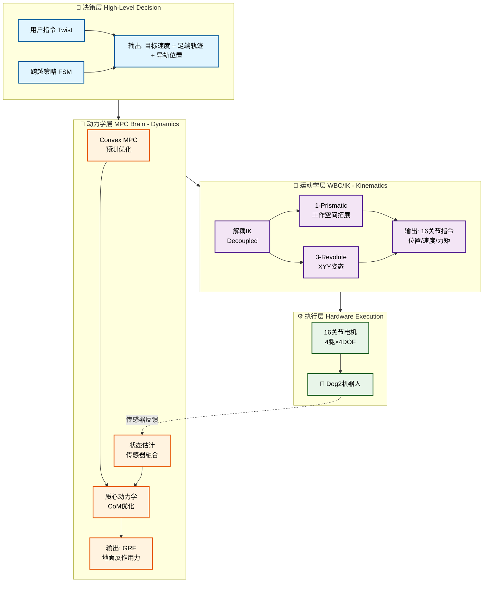

# Dog2机器人控制架构

## 系统架构流程图



## 三层架构说明

### 🎯 决策层 (1-10 Hz)
**输入**：用户指令 (Twist) + 跨越策略 (FSM)  
**输出**：目标速度、足端轨迹、导轨预置位  
**功能**：高层规划、步态切换、障碍跨越

### 🧠 动力学层 (10-50 Hz)
**输入**：目标速度、足端轨迹  
**输出**：地面反作用力 (GRF)  
**功能**：
- Convex MPC：预测优化
- 状态估计：传感器融合
- 质心动力学：力分配优化

### 🦾 运动学层 (100-1000 Hz)
**输入**：地面反作用力  
**输出**：16个关节位置/速度/力矩指令  
**功能**：
- 解耦式IK：降低计算复杂度
- 1-Prismatic：工作空间拓展 (X轴滑动)
- 3-Revolute：姿态调整 (XYY: Roll-Pitch-Pitch)

### ⚙️ 执行层 (1000+ Hz)
**组件**：16个关节电机 (4腿 × 4DOF)  
**反馈**：关节状态、IMU、接触力

## 数据流

```
用户指令 → 决策 → 动力学 → 运动学 → 执行 → 机器人
            ↑                              ↓
            └────────── 传感器反馈 ─────────┘
```

## 关键特性

| 特性 | 说明 |
|------|------|
| **分层架构** | 解耦设计、模块化、易扩展 |
| **4-DOF配置** | 1-P工作空间拓展 + 3-R姿态调整 |
| **实时性能** | MPC快速优化、解耦IK、并行计算 |
| **鲁棒性** | 多传感器融合、约束处理、故障恢复 |

## 实现文件

- **决策层**：`src/dog2_champ_config/`
- **动力学层**：`src/dog2_mpc/`
- **运动学层**：`src/dog2_kinematics/leg_ik_4dof.*`
- **执行层**：`src/dog2_description/`

## 总结

Dog2采用**三层控制架构**实现从用户指令到机器人执行的完整控制流程，核心创新是4-DOF腿部配置（1-Prismatic + 3-Revolute），提供更大工作空间和更好地形适应能力。
